# 🚀 GridLauncher 功能介绍

**💎 高级 · ⚡ 流畅 · 🎨 可定制 · 🔐 安全**

GridLauncher 是一款高度可定制、功能完整、细节打磨的 macOS 启动台替代应用。它以“菜单栏常驻 + 高度个性化 + 全链路应用管理”为核心，提供从应用扫描、分类、收藏、隐藏应用、搜索、整理、预览、备注、批量操作、备份恢复到视觉主题的全套解决方案。

> 📌 **本文包含：** 全量功能逻辑清单，便于快速阅读。

---

## ✨ 亮点速览

- 🧩 **完整替代 Launchpad**：布局、文件夹、分页与搜索全覆盖  
- 🗂️ **文件夹**：强大分类与组织  
- 🔎 **高性能搜索**：多权重排序 + 实时防抖  
- 🎬 **60 种主界面动画**：高级、现代、惊艳  
- 🔐 **安全与隐私**：密码 + Touch ID  
- 💾 **备份/恢复**：布局/样式/壁纸一键迁移  

---

## 🧭 目录

1. 🎯 产品定位与核心价值  
2. 🖥️ 主界面与交互逻辑  
3. 🧱 启动台布局系统  
4. 📦 应用管理与数据库缓存  
5. 📁 文件夹系统  
6. 🔎 搜索系统  
7. 🧲 拖拽与排序系统  
8. 🖱️ 右键菜单与快捷操作  
9. ✅ 批量操作与统计  
10. 👀 快速预览与图标备忘  
11. 💾 备份/导入导出与数据安全  
12. 🎨 个性化与视觉系统  
13. 🔐 安全与隐私  
14. 🌍 多语言  

---

## 1. 🎯 产品定位与核心价值

- ✅ **完整替代系统 Launchpad**：提供更强的整理能力、更丰富的视觉风格、更高的可定制性。  
- ✅ **菜单栏常驻入口**：一键快速呼出，随时管理应用（刘海屏屏幕可通过鼠标移动到刘海区域快速进行呼出）。  
- ✅ **强大分类与整理系统**：文件夹。  
- ✅ **多维度搜索**：高速、智能、带权重排序。  
- ✅ **全链路数据与配置管理**：布局、主题、动画、缓存、备份、恢复一体化。  

---

## 2. 🖥️ 主界面与交互逻辑

- 🧱 **主网格展示**：应用与文件夹以网格布局显示。  
- 🧭 **分页与滚动**：支持水平分页、页面指示器、垂直滚动模式。  
- ✍️ **编辑模式**：支持拖拽与重排。  
- 🎯 **刘海屏悬停触发**：支持基于悬停刘海区域灵敏度自动触发展示。  
- ⌨️ **快捷键与手势**：  
  - ⌘F：聚焦搜索  
  - Esc：关闭文件夹 → 清空搜索 → 关闭主界面  
  - ← / →：翻页  
  - Space：Quick Look 预览  

---

## 3. 🧱 启动台布局系统

核心逻辑涵盖：  

- 📄 **多页面管理**：自动创建与清理页面。  
- 🧭 **网格定位系统**：以 `page / row / column` 精确定位。  
- 🔁 **页面与位置移动**：支持同页移动、跨页移动、位置交换。  
- 📁 **文件夹创建/解散**：支持从页面创建文件夹、删除文件夹并回收应用。  
- ✅ **布局验证与修复**：  
  - 页面索引校验  
  - 文件夹引用校验  
  - 应用重复校验  
  - 自动修复  
- 💾 **布局序列化与反序列化**：支持 JSON 保存/恢复。  

---

## 4. 📦 应用管理与数据库缓存

### 4.1 应用模型

包含完整元数据与功能逻辑：  

- 名称 / 显示名称 / 路径 / 图标路径  
- 版本号 / 修改时间 / 文件大小  
- 隐藏状态  
- 图标缓存与缩略图生成（含文件夹缩略图网格）  

### 4.2 应用扫描与缓存

- 🔍 **应用扫描**：支持扫描授权目录。  
- 🗄️ **数据库缓存**：持久化缓存应用与分组数据。  
- 📡 **文件系统监控**：监听安装/卸载变化，自动增量更新。  
- 🚀 **启动与错误处理**：异步启动、失败原因细分、可重试策略。  
- ⚡ **统计与优化**：扫描防抖、缓存加载、增量更新队列。  

### 4.3 授权目录

- 🔐 安全沙盒授权 
- ➕ 添加 / ➖ 移除 / ⚙️ 管理授权目录。  

---

## 5. 📁 文件夹系统

### 5.1 文件夹

- 🧩 以网格位置创建  
- ✏️ 支持重命名 / 删除 / 移除应用  
- 🧱 文件夹图标自动生成 3x3 应用缩略图  
- 🎭 弹窗支持多种风格  
- 不修改系统文件，只做逻辑分类  
- 支持颜色、图标、自定义排序  
- 支持添加/移除/批量调整应用  
- 支持应用顺序重排（拖拽排序）  
- 统计信息（应用数量）  

**系统预设文件夹**：  

- ⭐ 收藏夹

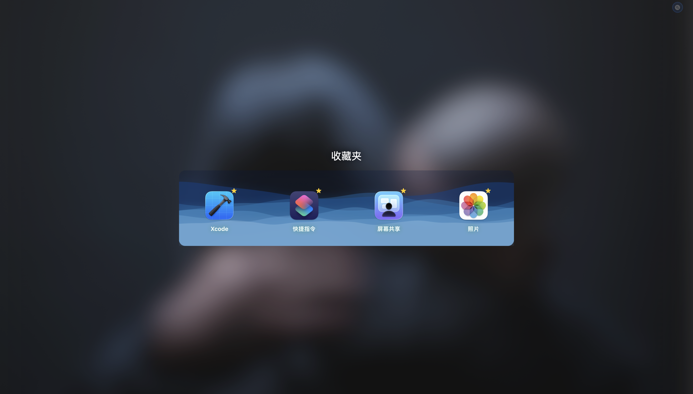

- 🙈 隐藏应用  

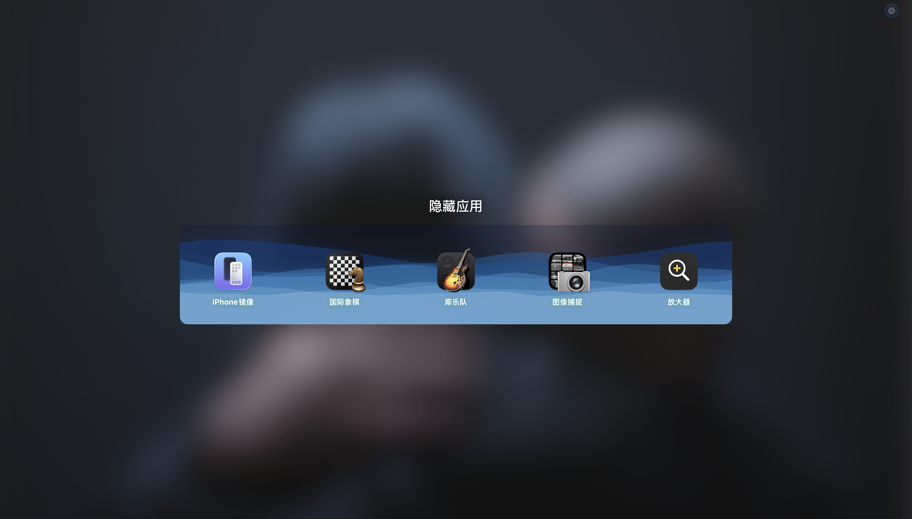

### 5.2 文件夹系统行为逻辑

- 系统预设文件夹不可删除  
- 支持清空用户文件夹  

---

## 6. 🔎 搜索系统

- 🔍 **多种匹配方式**：完整匹配 / 前缀匹配 / 包含匹配  
- 🧠 **搜索权重系统**：名称、显示名、类别、关键词、使用频率、最近使用、长度惩罚  
- ⚡ **实时搜索 + 防抖**  
- 🧹 **搜索缓存与 LRU 清理**  
- 🧠 **内存压力感知与缓存回收**
- 可搜索文件夹及app
- 隐藏app搜索不可见
- 主界面直接输入文字进行搜索
- ctrl +F 快速输入搜索
- ESC 退出搜索回到主界面

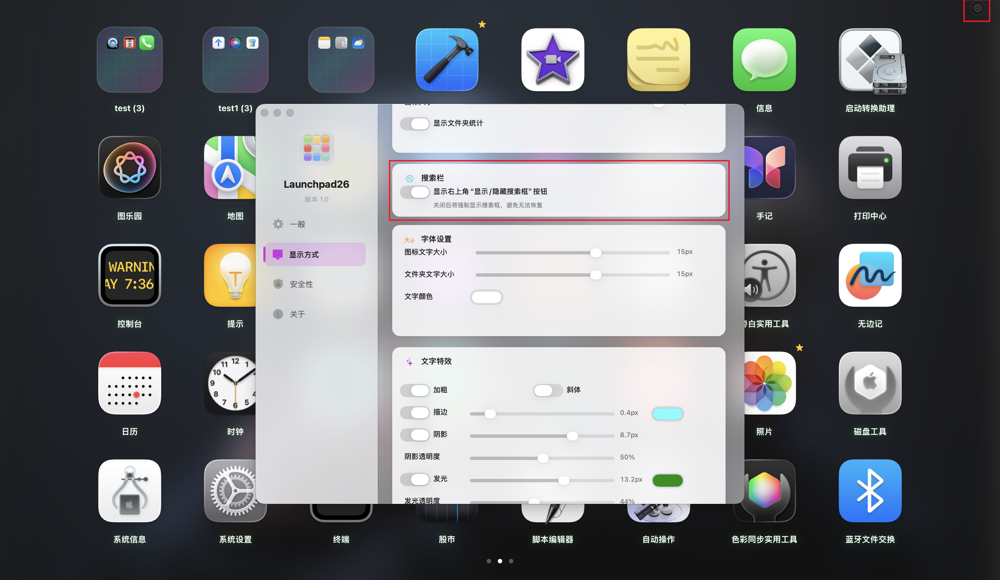

---

## 7. 🧲 拖拽与排序系统

- 🧷 **拖拽排序**：自由调整应用顺序  
- ↔️ **跨页拖拽**：拖拽至页面边缘自动翻页  
- 📁 **拖拽创建文件夹**：拖拽应用到另一个应用上自动生成文件夹
- 📁 拖拽图标到文件夹
- 不能将文件夹拖动到其他文件夹和普通图标
- 不能将图标拖入收藏夹
- 收藏夹不能拖动
- 批量操作模式下禁止拖动
- 🧩 **文件夹内拖拽排序**  
- ↩️ **拖拽出文件夹**：支持从文件夹弹窗拖回主界面  
- ✨ **拖拽视觉优化**：高质量 Ghost View、阴影、平滑跟随  

---

## 8. 🖱️ 右键菜单与快捷操作

支持上下文菜单：  

- 打开应用  
- 在 Finder 中显示  
- 显示简介
- 快速查看
- 共享
- 图标备忘  
- 收藏 / 取消收藏  
- 隐藏 / 显示应用  
- 从文件夹移除  
- 重命名 / 删除文件夹  

---

## 9. ✅ 批量操作与统计

- ☑️ 批量选择模式  
- 📁 批量移动到文件夹
- ⭐ 批量收藏
- 🙈 批量隐藏
- 批量模式下禁止拖动图标和右键操作
- 📊 应用统计信息（应用总数 / 收藏 / 隐藏 / 文件夹数）  

---

## 10. 👀 快速预览与图标备忘

- **Quick Look 预览**：原生风格预览窗口  
  - 展示图标、名称、版本号、版权、大小、上次修改时间  
  - ESC / Space 关闭，Enter 打开应用 

- **App Memo 图标备忘**：  
  - 编辑 / 预览模式切换  
  - 自动保存  
  - 支持 Ctrl 常见快捷键
  - 可拖动放大缩小窗口
  - 通过鼠标悬停在图标上面呼出备忘预览

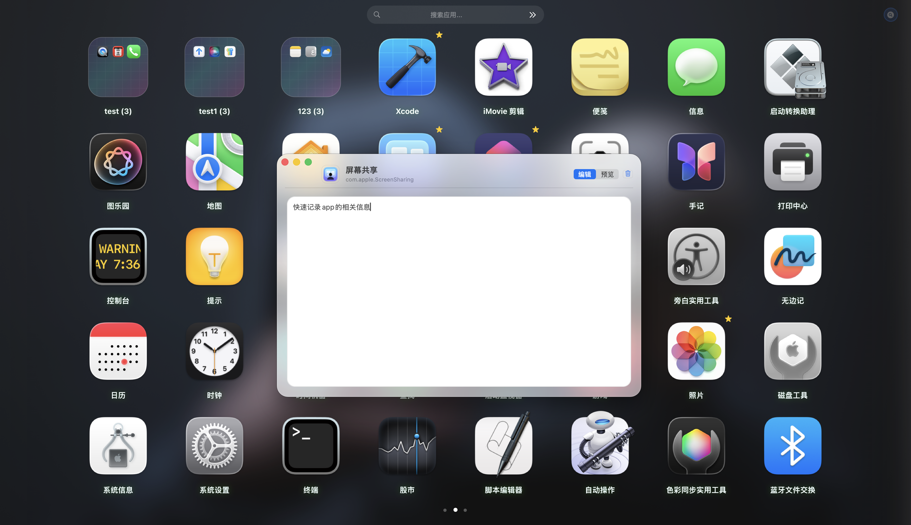

---

## 11. 💾 备份/导入导出与数据安全

支持完整配置备份：  

- 网格配置（行/列/图标尺寸）  
- 显示顺序（应用排序索引）  
- 文件夹  
- 收藏 / 隐藏应用  
- 用户设置（背景透明度、文字样式、悬停灵敏度、动画风格等）  
- 壁纸配置（渐变/预设/自定义）  
- 自定义壁纸文件  
- 授权扫描目录（仅备份路径，重置后需重新授权）  

支持：  

- 📤 一键导出  
- 📥 一键导入  
- 🧹 一键重置全部数据  

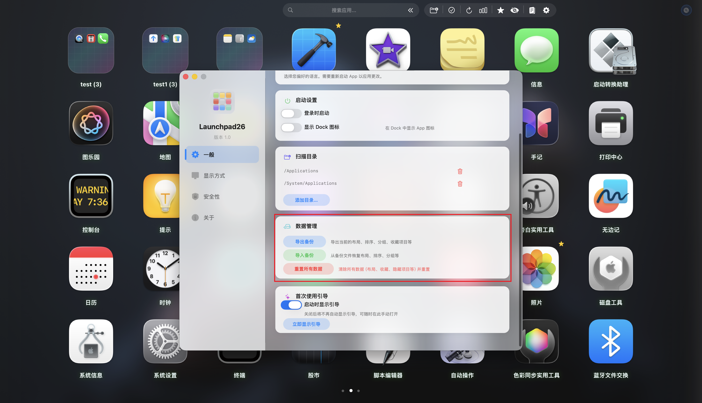

---

## 12. 🎨 个性化与视觉系统

### 12.1 主题设置

可配置项：  

- 背景壁纸
- 背景透明度  
- 背景模糊风格
- 文件夹弹窗风格
- 文件夹图标风格
- 主界面动画
- 布局模式
- 行数/列数
- 图标大小
- 显示文件夹统计
- 右上角显示搜索栏
- 图标文字大小
- 文件夹文字大小
- 文字颜色
- 文字特效(加粗、斜体、描边、阴影、阴影透明度、发光、发光透明度)
- 主界面是否显示收藏夹

### 12.2 背景壁纸

- **壁纸类型**：gradient / preset / custom  
- **预设壁纸分类**：gradient / minimal / geometric / nature  
- **自定义壁纸**：最多 10 张，支持安全书签持久访问
- 可预览
- 可删除自定义壁纸

### 12.3 背景透明度

- 可设置0~100%透明度比例

### 12.4 背景模糊风格

- enhanced（增强）  
- macos（macOS风格）  

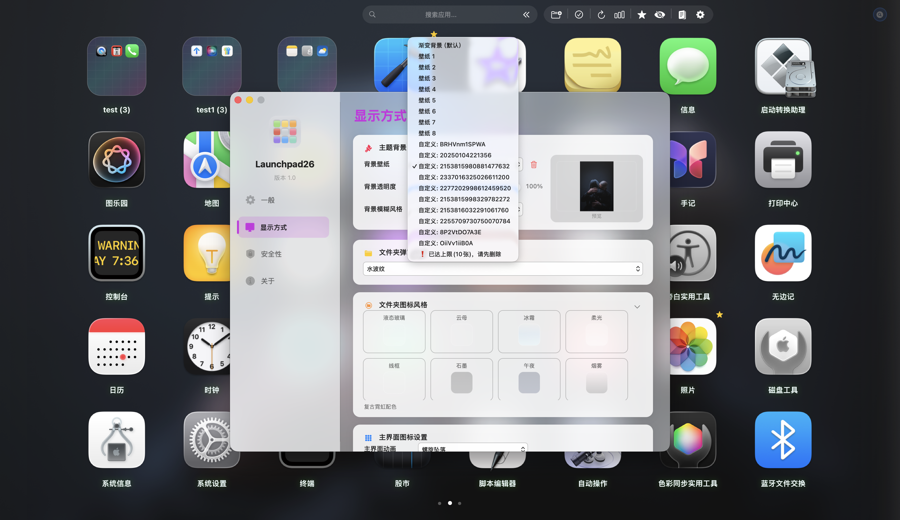

### 12.5 文件夹弹窗风格

- glass（液态玻璃）  
- depth（3D凹陷窗口）  
- borderless（无边框）  
- ripple（水波纹）  
- starfield（星空）  
- antigravity（反重力漂浮）  
- scifi（科幻连线）  

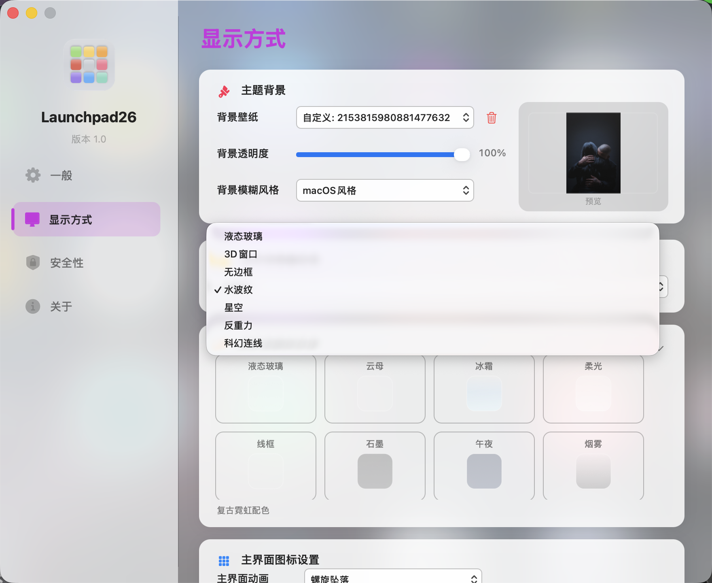

### 12.6 文件夹图标风格

**Classic / Material**  
glass, mica, frost, soft, outline, graphite, midnight, smoke, coffee  

**Textures / Surfaces**  
sand, wood, marble, granite, linen, leather, denim, velvet, terrazzo, paper, clay  

**Metals**  
steel, chrome, gold, copper  

**Gradients**  
aurora, prism, sunset, pastel, ocean, forest, lava, ice  

**Patterns / Special**  
blueprint, circuit, carbon, pixel, ink, neon, constellation, topography, origami, sticker, vaporwave, synthwave  

**Shapes**  
circle, hexagon, diamond, cutcorner, squircle, octagon, shield, blob, triangle, pentagon, star, heart, droplet  

**Animated**  
pulse, hologram, shimmer, scanline, orbit, sparkle, breathe, glitch, ripple, comet, halo, wave, chroma  

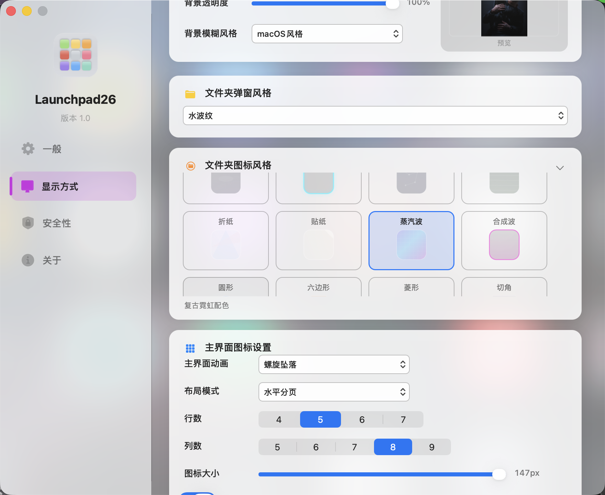

### 12.7 🎬 主界面动画

1. 整体弹出  
2. 随机飞入  
3. 中心散开  
4. 行波浪  
5. 随机缩放  
6. 螺旋环绕  
7. 径向涟漪  
8. 冲击波  
9. 磁吸聚拢  
10. 螺旋坠落  
11. 卡片翻转  
12. 折纸展开  
13. 视差漂移  
14. 全息扫描  
15. 镜面扫光  
16. 粒子爆发  
17. 霓虹轨迹  
18. 像素溶解  
19. 矩阵列瀑布  
20. 星座连线  
21. 对角线扫入  
22. 对角线反向扫入  
23. 棋盘弹出  
24. 蛇形穿行  
25. 双侧幕帘  
26. 垂直分割翻转  
27. 水平分割翻转  
28. 十字展开  
29. 左上角绽放  
30. 右下角绽放  
31. 边缘内卷  
32. 菱形脉冲  
33. 雷达扫描  
34. 扇形展开  
35. 倾斜回正  
36. 铰链摆动  
37. 深度上浮  
38. 重力下落  
39. 浮力上升  
40. 弹性质压  
41. 弹性拉伸  
42. 摇摆旋转  
43. 抖动归位  
44. 光圈揭示  
45. 狭缝揭示  
46. 百叶揭示  
47. 光晕脉冲  
48. 光束扫过  
49. 闪耀星点  
50. 棱镜残影  
51. 乱序漂浮归位  
52. 乱序漂浮快归  
53. 乱序漂浮慢归  
54. 乱序上下漂  
55. 乱序左右漂  
56. 乱序波动归位  
57. 乱序环绕归位  
58. 乱序脉冲归位  
59. 乱序倾斜归位  
60. 乱序纵深归位  

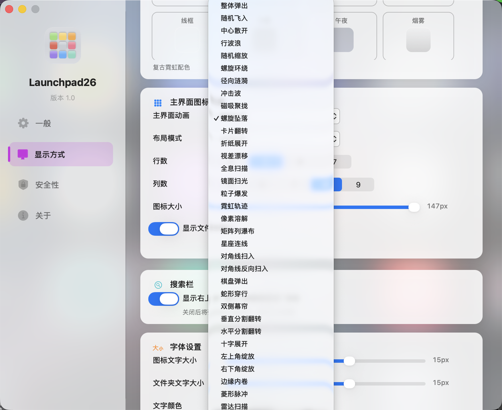

### 12.8 布局模式

- 水平分页/垂直分页

### 12.9 行数/列数

- 行数：4、5、6、7行
- 列数：5、6、7、8、9列

### 12.10 图标大小

- 根据行数列数设置自动限制图标大小最大限制

### 12.11 显示文件夹统计

- 勾选在主界面文件夹名称右侧显示文件夹中图标数量

### 12.12 右上角显示搜索栏

- 勾选在主界面右上角显示控制按钮
- 点击控制按钮控制是否显示搜索框及按钮区

### 12.13 图标文字大小

- 可设置10~18px

### 12.14 文件夹文字大小

- 可设置10~18px

### 12.15 文字颜色

- 点击可呼出颜色选择器进行颜色设置

### 12.16 文字特效
 
- 粗体 / 斜体  
- 描边（颜色 / 宽度）  
- 阴影（强度 / 阴影透明度）  
- 发光（颜色 / 强度 / 发光透明度）  

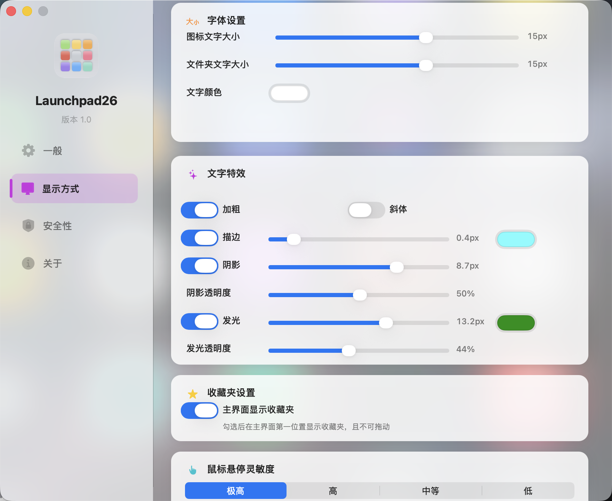
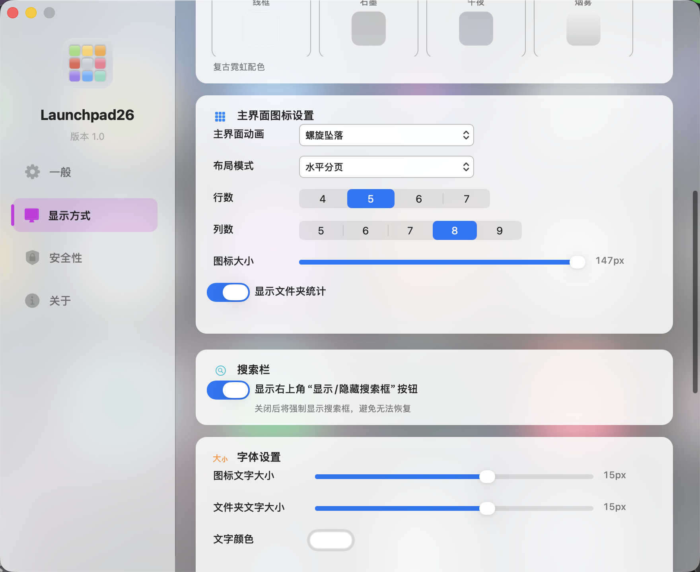

---

## 13. 🔐 安全与隐私

安全功能逻辑：  

- 隐藏应用访问密码  
- Touch ID 支持（若设备支持）  
- Keychain 安全存储（无明文备份）  
- 密码输入窗口（现代化 HUD 风格）  
- 仅授权目录扫描

---

## 14. 🌍 多语言

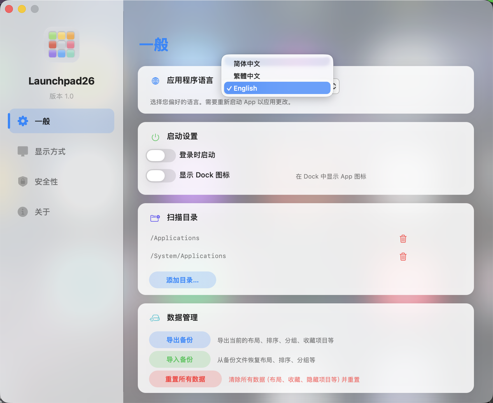

---
